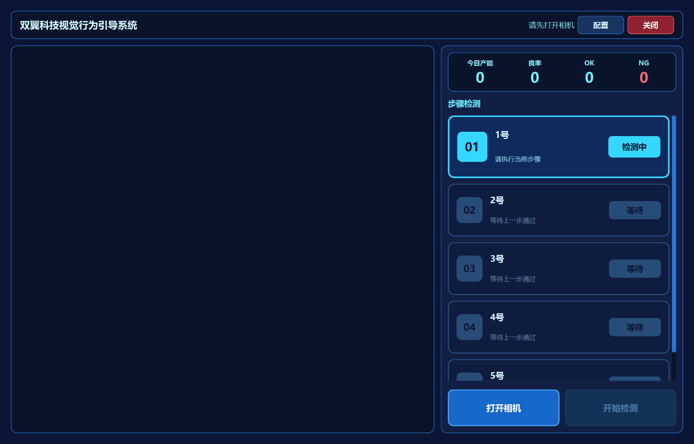
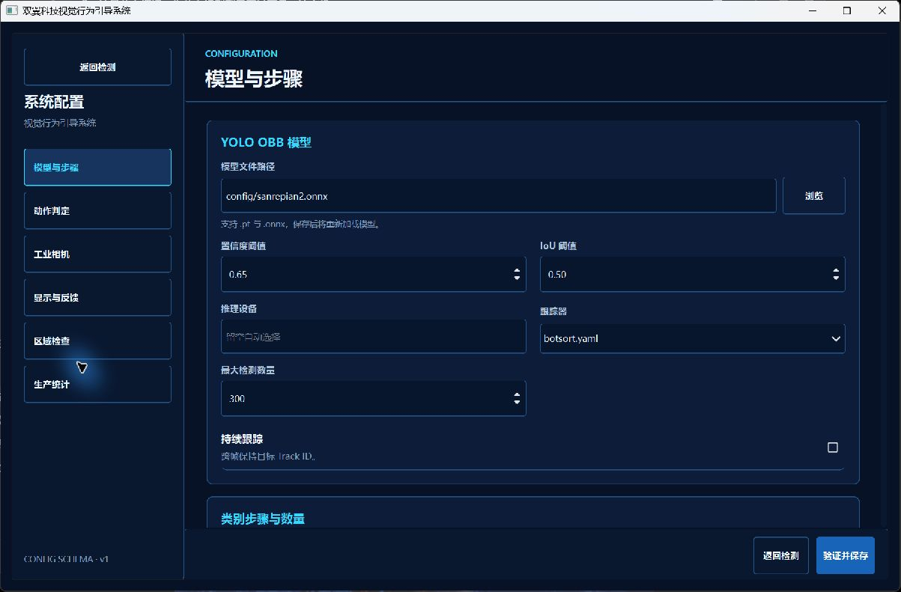

# 双翼科技工业视觉作业顺序防错系统

基于 YOLO OBB、ONNX Runtime 和 PySide6 的工业视觉边缘应用。系统面向装配、锁附等快节拍产线，通过工业相机实时检查工人是否在指定目标位置完成对应作业动作，并将模型输出的作业目标或动作点类别映射为可配置工艺步骤。

顺序状态机按照配置的 SOP 检查作业流程：符合顺序则推进步骤并记录 PASS；出现跳步、错序或未按配置步骤作业时，立即判定 FAIL，触发声音提醒、保存现场证据并记录生产统计。

当前公开演示模型默认使用 1号 到 5号 作为工艺步骤标签。这不是固定业务限制；类别名称、步骤数量、步骤顺序和检测目标都可以通过配置和更换模型调整，适配不同工装、孔位、动作点或作业流程。

本仓库为可公开展示的工程版本：保留运行所需源码、模型、配置、资源和打包脚本，不包含开发期测试、OpenSpec 和草稿文档。

## 项目展示

### 实际运行演示

点击上方动图可打开高清 MP4 演示视频。

### 主检测界面

### 配置与生产统计

## 解决的问题

在产线装配中，作业节拍快、人工很难持续确认每个工人是否严格按 SOP 顺序操作。该系统将视觉检测结果转化为工艺步骤状态，形成实时防错闭环：

- 作业目标检测：识别当前画面中被操作的目标位置、动作点或工艺步骤类别。
- 工艺顺序校验：按配置步骤逐项推进，确认工人是否按指定顺序作业。
- 错序防呆：首步启动后，后续跳步、错序达到 NG 稳定帧立即 FAIL。
- 现场追溯：NG 时保存证据图片和 metadata。
- 生产统计：统计总数、OK、NG、良率，并支持手动归零归档。
- 交付部署：PyInstaller 打包后可复制到无 Python 的目标电脑运行。

## 核心能力

| 模块 | 能力 |
| --- | --- |
| 实时采集 | 支持工业相机 SDK 和 OpenCV 采集链路 |
| 模型推理 | 使用 ONNX YOLO OBB 模型检测可配置的作业目标或动作点类别 |
| 顺序判定 | 将模型类别映射为工艺步骤，使用状态机校验 SOP 顺序 |
| 结果反馈 | PASS / FAIL 声音提示，FAIL 证据图片保存 |
| 生产统计 | 总数、OK、NG、良率展示，归零时生成统计记录 |
| 配置中心 | 模型路径、类别名称、步骤顺序、稳定帧、声音、证据、相机参数可配置 |
| 便携交付 | PyInstaller 打包，目标电脑无需安装 Python |

## 系统架构

    工业相机 / OpenCV
          |
          v
    CameraWorker 实时采集
          |
          v
    ONNX OBB Processor 作业目标或动作点检测
          |
          v
    StepSequenceEngine 工艺顺序状态机
          |
          +--> PySide6 主界面状态刷新
          +--> PASS / FAIL 声音反馈
          +--> FAIL 证据保存
          +--> ProductionStats 生产统计归档

## 技术栈

| 分类 | 技术 |
| --- | --- |
| 语言 | Python 3.11 |
| 桌面 UI | PySide6 |
| 视觉处理 | OpenCV |
| 推理引擎 | ONNX Runtime |
| 检测模型 | YOLO OBB |
| 工业相机 | MvSDK 封装 |
| 打包 | PyInstaller |
| 配置与记录 | JSON |

## 工程亮点

### 1. 模型类别可配置为工艺步骤输入

模型不再依赖特定工具与位置交集规则，而是直接输出当前画面命中的作业目标或动作点类别。状态机只关注该类别是否匹配当前配置步骤，因此同一套软件可以通过更换模型和配置，适配不同产品、工装、孔位和作业流程。

### 2. 适合快节拍产线的 PASS / NG 稳定策略

PASS 和 NG 使用独立稳定帧配置。默认 PASS 1 帧、NG 2 帧，减少快速动作下的漏判，同时避免单帧抖动导致误报警。

### 3. 第 1 步 PASS 后才允许 NG

新一轮必须先完成第 1 步，才会允许后续步骤触发错序 NG。这样可以过滤上一件产品残影、模型短暂误输出和画面噪声。

### 4. 终止式 NG 和自动下一轮

检测到错序 NG 后，当前产品立即结束并记录 FAIL，系统自动进入下一轮第 1 步等待。重新检测到第 1 步后才允许下一次 NG，避免同一错误动作连续刷多次 FAIL。

### 5. 生产统计批次归档

开始检测、停止检测和关闭相机都不会清零统计。只有配置页的“归零并保存记录”会先写入生产记录，再清零并开启新批次，符合真实生产场景。

### 6. 便携部署

打包目录包含模型、配置、声音和运行依赖。目标电脑只需要相机驱动，复制目录后即可双击运行。

## 项目结构

| 路径 | 说明 |
| --- | --- |
| yolo_action_detection/src/main.py | 程序入口和便携路径初始化 |
| yolo_action_detection/src/ui | PySide6 主界面、配置页和科技风组件 |
| yolo_action_detection/src/camera | 相机采集、SDK 封装和推理线程 |
| yolo_action_detection/src/yolo_runtime | YOLO OBB / ONNX Runtime 推理 |
| yolo_action_detection/src/step_sequence | 工艺步骤顺序状态机 |
| yolo_action_detection/src/detection_logging | 声音反馈、FAIL 证据、生产统计记录 |
| yolo_action_detection/config | 默认配置和 ONNX 模型 |
| yolo_action_detection/assets | PASS / FAIL 声音、展示截图与演示素材 |
| yolo_action_detection/packaging | PyInstaller 打包脚本 |

## 快速启动

源码运行：

    cd yolo_action_detection
    ..\.venv\Scripts\python.exe src\main.py

便携打包：

    cd yolo_action_detection
    .\packaging\build_yolo.bat

打包输出：

    yolo_action_detection/dist/YOLOActionDetection

目标电脑需要安装相机驱动。复制打包目录后，双击 YOLOActionDetection.exe 或 start.bat 启动。

## 关键配置

| 配置项 | 说明 |
| --- | --- |
| yolo_model_path | ONNX / YOLO 模型路径 |
| category_names | 工艺步骤类别名称和顺序，演示默认 1号 到 5号，可随模型调整 |
| first_category_region_check_enabled | 启用后类别 1 作为父区域，后续类别作为需归属到父区域内的子控件 |
| action_pass_stable_frames | PASS 稳定帧 |
| action_ng_stable_frames | NG 稳定帧 |
| action_order_constraint_enabled | 是否启用错序 NG |
| sound_feedback_enabled | 是否启用 PASS / FAIL 声音 |
| fail_evidence_enabled | 是否保存 FAIL 证据图片 |

## 输出与记录

| 输出 | 路径 |
| --- | --- |
| FAIL 证据图片 | yolo_action_detection/outputs/evidence |
| 生产统计记录 | yolo_action_detection/outputs/production_records |
| 便携 smoke 日志 | dist/YOLOActionDetection/logs |

## 验证

发布前已完成以下验证：

- 源码 portable smoke：通过
- 模型路径、声音资源、证据目录：通过
- MvSDK 可用性检查：通过
- main 分支只保留运行文件和展示素材：通过
- google 分支只保留 legacy 运行文件：37 个 tracked files

## 分支说明

| 分支 | 说明 |
| --- | --- |
| main | YOLO OBB 作业顺序防错正式版本 |
| google | Google / MediaPipe legacy 版本 |

## 求职展示重点

这个项目展示的不是单纯的模型分类或推理调用，而是一个完整的工业视觉现场工具：

- 作业目标与动作点检测建模
- ONNX Runtime 实时推理链路
- SOP 工艺顺序状态机
- 工业相机适配
- 桌面 UI 设计
- 现场配置能力
- 证据追溯
- 生产统计
- 便携部署

适合用于展示计算机视觉、桌面客户端、生产现场工具和工程交付能力。
